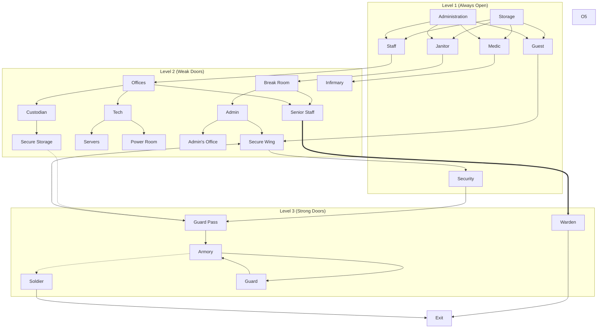
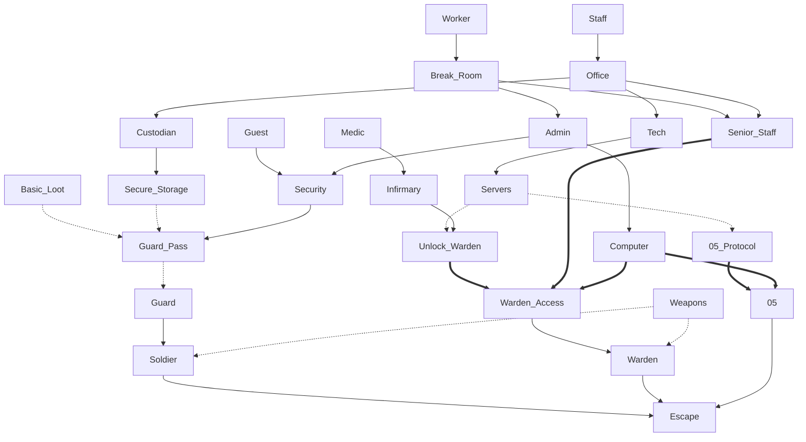

| Level | Room           | Loot                      | Others                |
| ----- | -------------- | ------------------------- | --------------------- |
| 1     | Storage        | Basic                     |                       |
| 1     | Administration | Basic                     | Map                   |
| 1     | Security       | Bag                       | Computer?, Contraband |
| 2     | Office         | Cards                     |                       |
| 2     | Break Room     | Cards, Better             | Bin                   |
| 2     | Admin          | Weapon, Basic             | Computer, Bin         |
| 2     | Power Room     | Generator                 | Backup Power, Bin     |
| 2     | Servers        | Discs                     |                       |
| 2     | Infirmary      | Meds, (Unlock Warden)     |                       |
| 2     | Secure Storage | Secure                    |                       |
| 3     | Warden         | Warden Card, Weapon       |                       |
| 3     | Armory         | Weapons, Guard, (Soldier) | Big has double door   |
- Rethink 05 Access
## Escape Paths

